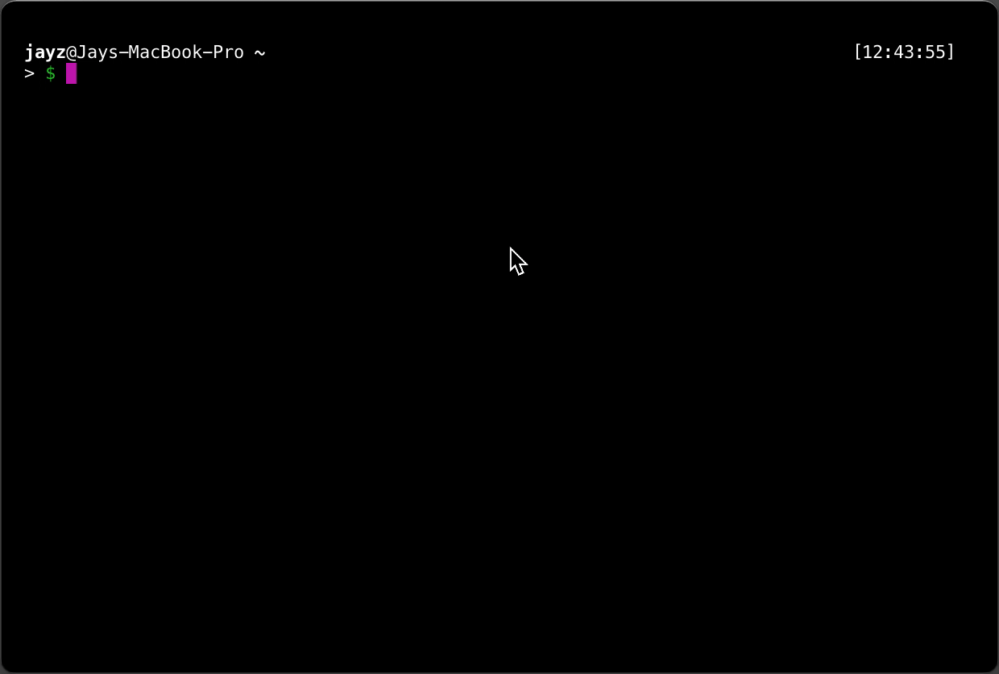

# hyper-tabs-autohide

Hyper plugin for autohiding all tabs.

This plugin has only been tested on MacOS. It might not work well with other operating systems.

Inspired by [hyperminimal](https://github.com/jancborchardt/hyperminimal)

## How to use

Add `hyper-tabs-autohide` to `plugins` in `~/.hyper.js`.

## License

MIT
